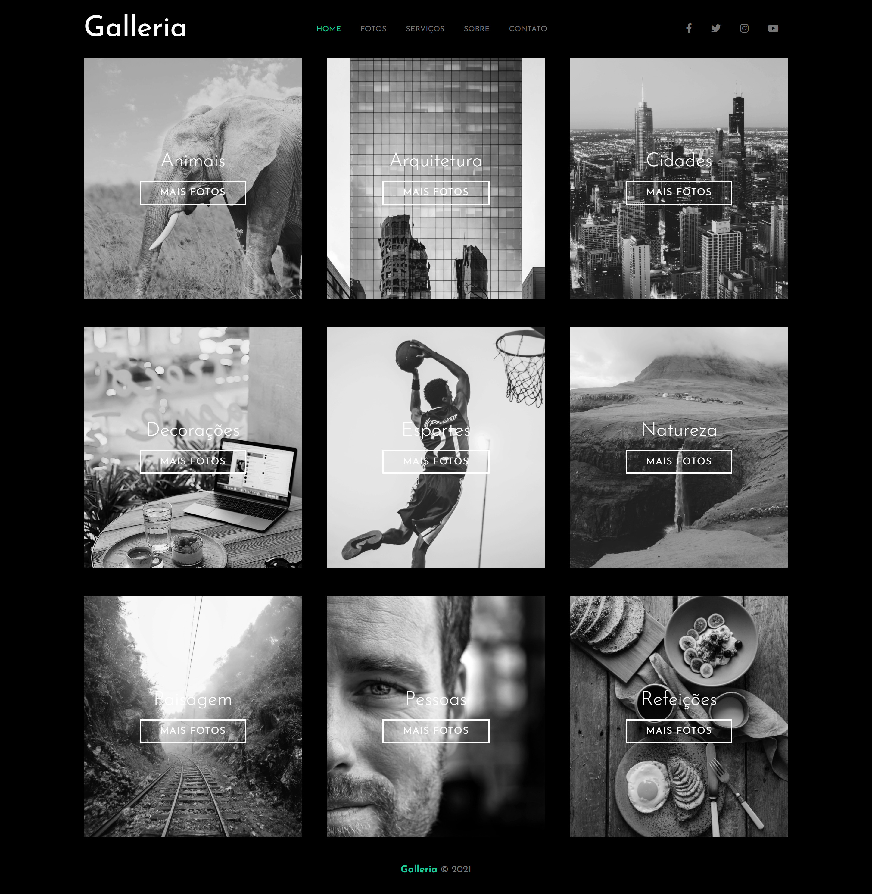
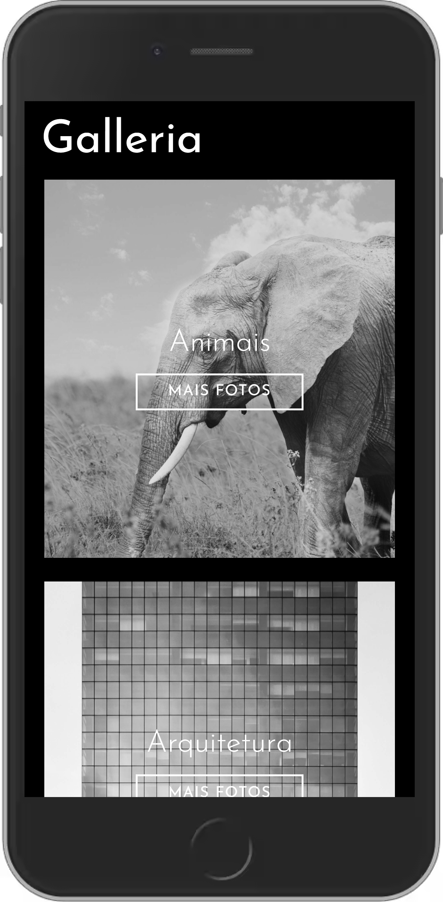

## README

# GALLERIA

In this first gallery project using SASS I learned everything from installing and creating a project with SASS and SCSS to adding responsiveness.

I learned features used in SASS like: mixins, nesting, parent selector and others.

# DESKTOP PROJECT
<h1 align="center"> 
     
</h1>

# MOBILE PROJECT
<h1 align="center"> 
     
</h1>

# 🚀 Technologies

This project was developed with the following technologies:

- [HTML](https://developer.mozilla.org/pt-BR/docs/Web/HTML)

- [CSS](https://developer.mozilla.org/pt-BR/docs/Web/CSS)

- [SASS](https://sass-lang.com/)

Made with ♥ by Matheus Vieira 👋[Get in touch!](https://www.linkedin.com/in/matheus-silva-vieira/)